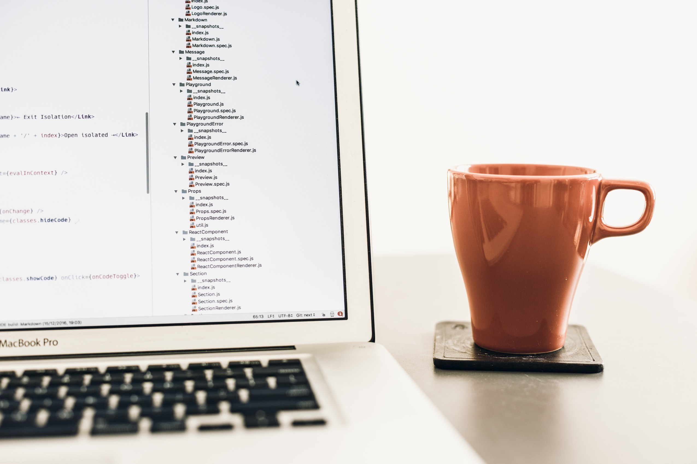

# Chai-and-Code

#### _A Portfolio site, 12-1-2017_

#### By _**Qudsia Ahmad**_

## Description

_This portfolio is meant to be a work-in-progress, allowing me practice with Rails while giving me the opportunity to reflect on my strengths and personal interests as they pertain to the world of coding and development.  I would like it to be a place to showcase the specific skills and experiences I bring to the table which make me a valuable contributor to any team.

Some of the

  STRENGTHS:
  Commitment
  Persistence
  Self-reflection
  Communication
  Consistent Learning
  Focus
  Cultural Competency
  Ability to collaborate and communicate

  Updated past projects, took screenshots to upload them to the projects in the portfolio.

   _

## Setup/Installation Requirements
* _Ensure you have Rails downloaded on your local computer _
* _git clone repo [this repository](https://github.com/q4hmad/chai-and-code).
* _cd into 'chai-and-code'
* _run 'Bundle Install'
* _in console, run 'rails s'
* _launch rails server and type 'localhost:3000/projects'
* _You may not be able to see my projects if I am currently working on the site, but check back!
* _

## Known Bugs

_Paperclip did not successfully install, and that issue  needs to be resolved _

## Support and contact details

_Since this is a personal portfolio, please be patient if you are not able to run the app and see my current list of projects at first. Be sure to check back to see how I'm doing on my coding journey._

## Technologies Used

_This application uses Ruby, Rails, HTML and CSS _

### License

*This software is licensed under the MIT License..*

Copyright (c) 2017 **_Qudsia Ahmad_**
